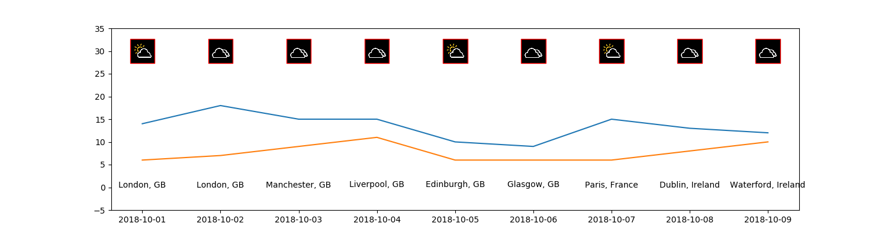

# Weather during Holidays

Small script that generates a plot with the weather for the next 10 days in different locations.

## Use

Update the [holidays.yaml](./holidays.yaml) file with the places and dates you
will visit. If the lat and long are provided, then you will get the weather for these coordinates.

It uses [Yahoo weather](https://www.yahoo.com/news/weather/) via
[weather-api](https://github.com/AnthonyBloomer/weather-api/).

Sample output:

